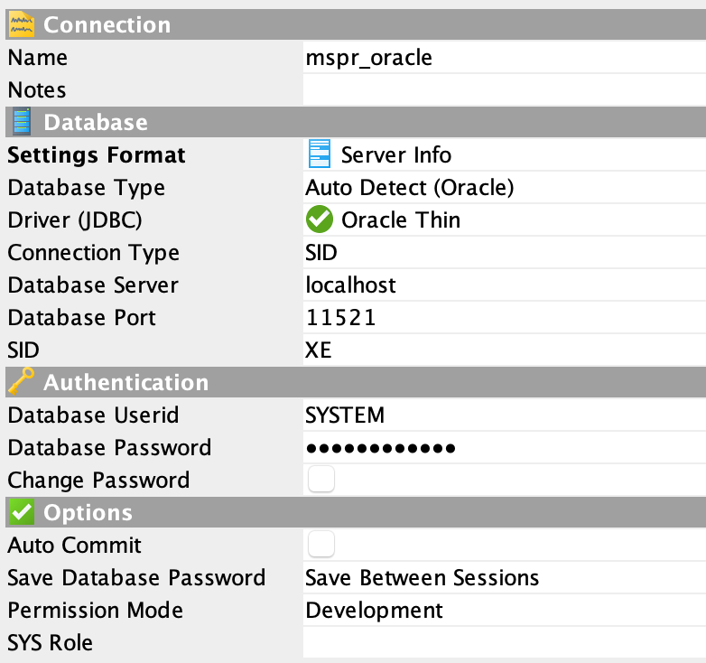

# Deploy Oracle Database

### **First Step** :

Clone the official repository with the command :

`git clone https://github.com/oracle/docker-images.git`

Now go to :

`cd ./OracleDatabase/SingleInstance/dockerfiles`

---

### **Build Docker Image** :

First, connect to Oracle.com and download the [binaries files of Oracle Database](https://www.oracle.com/database/technologies/oracle-database-software-downloads.html) with this command line :

`curl -LO https://download.oracle.com/otn/linux/oracle19c/190000/oracle-database-ee-19c-1.0-1.x86_64.rpm`

and copy and past the files in the folder version choosen, here 18.4.0 :

`cp ~/Downloads/oracle-database-xe-18c-1.0-1.x86_64.rpm ./18.4.0`

/!\ 

This previous step is not necessary if you already have an Oracle account. Before launching the bash scrypt connect to your account on oracle.com, and valid the CAPTCHA.

`INSTALL_FILE_1="https://download.oracle.com/otn-pub/otn_software/db-express/oracle-database-xe-18c-1.0-1.x86_64.rpm" \
    RUN_FILE="runOracle.sh" \`

Inside dockerfile.xe, it will download the binaries files.

/!\ 

Now you can build Docker Image.

Here we work with the 18.4.0 version :

`./buildDockerImage.sh -x -v 18.4.0`

-x -> for the express edition.

-v -> designated version of Oracle Database

This step will take time.

Now look your docker image, you should have a docker image named `oracle/database:18.4.0-xe`

---

### **Using Docker compose** :

Now we have the image for Oracle, we can start a local database with the docker-compose in the project.

Change the password for your usage.

---

### **Connect with tool for database administrations** :

Here I use DbVisualizer, but another tool like DBeaver work too.

_Configuration for Express Edition_ :

---

###### Source :

- [Tuto](https://www.petefreitag.com/item/886.cfm)
- [Docker Image For Oracle readme](https://github.com/oracle/docker-images)

###### Credit :

**Maurin Nicolas**